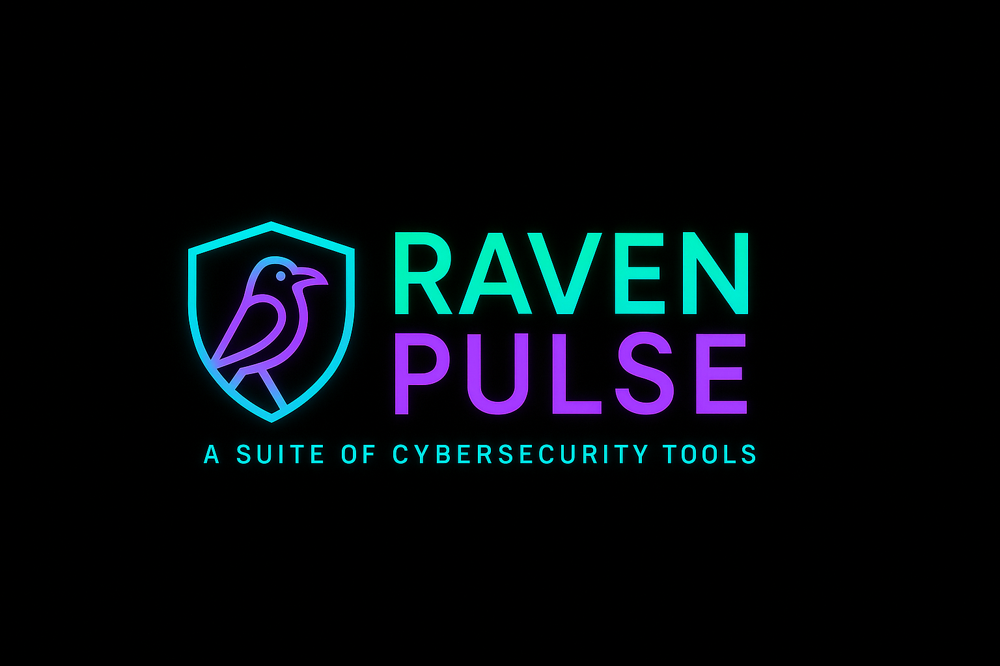

A powerful, modular suite of Python-based cybersecurity tools. Built for learning, testing, and enhancing both offensive and defensive security skills that I have been learning and turning into a real-life project.


> ⚙️ This project was created as a hands-on journey to sharpen coding skills and to gain the confidence and capability to build custom cybersecurity tools from scratch.

---

## ✅ Completed Tools
  - [x] **Password Strength Checker**
  - [x] **Checks password complexity**
  - [x] **Optional entropy scoring**
  - [x] **Port Scanner /Normal mode & Stealth mode (WIP unittest)**
## 🚧 Tools in Progress
- [ ] **Subdomain Enumerator**
- [ ] **Whois + DNS Recon Tool**
- [ ] **Simple Packet Sniffer**
- [ ] **IP Rotator / IP Hider**
- [ ] **Brute-Force Login Tool**
- [ ] **Malware Analysis Sandbox**
- [ ] **Log Analyzer for Intrusion Detection**
- [ ] **Simple Honeypot**
- [ ] **Payload Generator**

## 🛠️ Installation

Clone the repo:

```bash
git clone https://github.com/alexola/cyber.git
cd cyber
```

Install dependencies:

```bash
pip install -r requirements.txt
```
---

## 🔐 Password Strength Checker

✨ Features

- Modular design: easily add new tools
- Menu-driven interface for easy tool selection
- Password strength checker with entropy scoring
- Clean codebase and repository hygieneevaluates the strength of user-provided passwords based on length, character variety, and more.

### Usage

```bash
python3 recon-suite/main.py
```
### Output Example

```
Enter your password: P@ssw0rd123!
Password Strength: Strong
Feedback: Good job! Try not to reuse this password across sites.
```

---

## 🧼 Repository Hygiene

To maintain a clean, efficient project, we’ve included a `.gitignore` file to exclude:

- Python bytecode & cache  
- Environment folders (`env/`, `venv/`)  
- OS clutter files (`.DS_Store`, `Thumbs.db`)  
- IDE configs (`.vscode/`, `.idea/`)  
- Logs, temp files, and backups  

> ➡️ See `.gitignore` for the full list

### 🤝 Contributing

As this is a learning-focused open project. Pull requests, issues, and suggestions are welcome the idea is to keep on growing this toolset .

So please feel free to fork the project, work on a feature/tool, and open a pull request. Even simple feedback is appreciated!

---

## 📜 License

MIT License — see the [`LICENSE`](LICENSE) file for full details.

---

### 👩‍💻 Author

**GitHub**: [alexola](https://github.com/alexola)

> ⚠️ **Note:**  
> To use the port scanner in **stealth mode**, you must run the program with administrator privileges:
> - On macOS/Linux: use `sudo python3 recon-suite/main.py`
> - On Windows: run your terminal as Administrator
>
> This is required for sending raw packets (SYN scans) with Scapy.